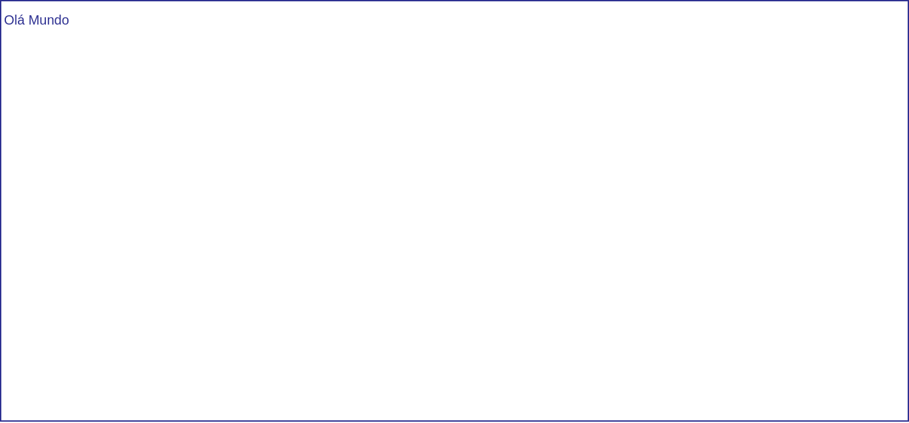

# Começando com VUE

> "Eu sempre fiz algo que eu estava pouco preparada para fazer. Eu acho que é assim que você cresce. Quando há aquele momento de 'Wow, não tenho certeza de que posso fazer isso', e você passa por esses momentos, é quando você tem um avanço."
> — Marissa Mayer

Como aprendemos anteriormente, uma interface pode e deve ser divida em vários componentes. Vamos começar a criar nossos primeiros componentes usando o Vue.js.

## Tudo numa coisa só

Vue trabalha na estrutura de HTML, CSS e JS em um único arquivo, chamamos isso de **Single file components**, o componente inteiro em um arquivo.

Um componente em Vue se divide em três tags: template, script, e style. Dentro da tag template é onde colocamos o HTML normal que já conhecemos, divs, headers, parágrafos, etc. Dentro de script colocamos o javascript. E por fim, em style colocamos o nosso CSS.

```vue
<template>
</template>

<script>
</script>

<style>
</style>
```

Podemos usar um atributo em style chamado scoped, se usarmos, os estilos declarados no componente estilizam somente esse componente, o que pode ser bem útil em grandes aplicações.

```vue
<template>
  <div>
    <p>Olá Mundo</p>
  </div>
</template>

<script>
export default {
  name: 'hello'
}
</script>

<style scoped>
div {
  margin-top: 0.5em;
  padding: 0.25em;
}
p {
  margin: 0;
  padding: 0.25em 0;
  font-size: 1.25em;
}
</style>
```


## Ligando dados
  
Dentro do template podemos usar a **sintaxe mustache**, {{ duas chaves }}, e colocar expressões em Javascript. Criamos um mustache com uma varíável chamada mensagem e atribuímos a ela uma frase. Você pode entender uma variável como um espacinho na memória reservado a guardar alguma coisa, algo como reservar um espaço em um armário para guardar futuramente alguma coisa.

```vue
<template>
  <div>
    <h1>{{ mensagem }}</h1>
  </div>
</template>

<script>
export default {
  name: 'ola',
  data () {
    return {
      mensagem: 'oláaaaaaaaaaaaaaaa'
    }
  }
}
</script>

<style scoped>
</style>
```
Nossos dados estão ligados. O que acontece dentro de template reflete também no script, e o que acontece no Javsacript também reflete no template.

O vue tem algumas palavras reservadas chamadas de Diretivas que nos permitem adicionar alguns comportamentos. Uma dessas diretivas é a **v-model**, vamos usa-la para criar um two-way **data binidng**, ou ligação de dados por dois caminhos em um elemento.

O v-model é semelhante a outros atributos comuns que usamos no HTML, adicionamos como valor nesse atributo a nossa variável, depois usamos um mustache com a mesma variável para mostrar o que o usuário digitou em nosso input. Os dados estão mesmo ligados! Esse é um recurso incrível e o usaremos muito em nossas aplicações.

```vue
<template>
  <div>
    <p>Quantos anos você tem?</p>
    <input v-model="idade">
    <p>você tem {{ idade }} anos de idade.</p>
  </div>
</template>

<script>
export default {
  name: 'ola',
  data () {
    return {
      idade: ''
    }
  }
}
</script>

<style scoped>
</style>
```

