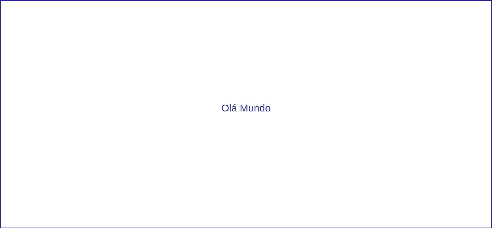

# Criando novas páginas e componentes

> "Eu não gosto de estudar, eu odeio estudar. Eu gosto de aprender, aprender é lindo."
> — Natalie Portman

Já entendemos o que são componentes, agora vamos aprender a criar os nossos próprios componentes e páginas através do vue-router. Vamos criar um novo componente chamado Ola.vue com o seguinte conteúdo:

```vue
<template>
  <div>
    <p>Olá Mundo</p>
  </div>
</template>

<script>

export default {
  name: 'Ola'
}
</script>

<style scoped>
div {
  display: flex;
  flex-direction: column;
  align-items: center;
  justify-content: center;
  margin-top: 0.5em;
  padding: 0.25em;
}
p {
  margin: 0;
  padding: 0.75em 0;
  font-size: 1.75em;
}
</style>
```

Na estrutura que criamos já existe um arquivo com o vue-router estruturado, vamos agora modifica-lo, ele está dentro da pasta src/router, em um arquivo index.js.

Agora precisamos criar uma rota para esse componente no vue-router. Nas primeiras linhas estamos importando o Vue, o Router, e o componnte Hello. Vamos adicionar mais uma linha para importar o nosso Ola. 

Feito isso, precisamos também de configurar a rota, o vue já criou a nossa primeira rota, a path '/', o nosso componente que é exibido como primeira página. Vamos criar uma segunda com '/Ola'

```js
import Vue from 'vue'
import Router from 'vue-router'
import Hello from '@/components/Hello'
import Ola from '@/components/Ola'

Vue.use(Router)

export default new Router({
  routes: [
    {
      path: '/',
      name: 'Hello',
      component: Hello
    },
    {
      path: '/Ola',
      name: 'Ola',
      component: Ola
    }
  ]
})
```



Agora temos uma nova página para nosso componente Ola. Podemos criar mais um componente dentro de nosso componente.

Vamos criar um novo arquivo chamado Gato.vue com o seguinte conteúdo:
```vue
<template>
  <div>
  	
  </div>
</template>

<script>
export default {
  name: 'Gato'
}
</script>

<style scoped>
img {
  width: 600px;
}
</style>
```
Agora vamos chamar nosso componente Gato dentro do componente Ola. Dentro do template usamos como tag o nome do nosso componente!

```vue
<template>
  <div>
    <gato></gato>
    <p>Olá Mundo</p>
  </div>
</template>
```

Dentro do script importamos o componente assim:

```vue
<script>
import gato from './Gato.vue'

export default {
  name: 'OlaMundo',
  components: { gato }
}
</script>
```


