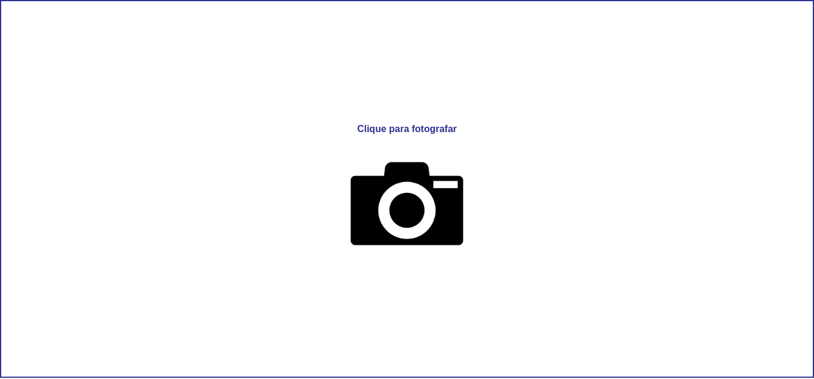

# Eventos e Métodos

Há muitos eventos que acontecem em nossa página, como eventos do mouse, eventos do teclado, etc. E podemos manipula-los conforme nossas necessidades.

Mais uma diretiva bem legal do Vue é a [v-on](https://br.vuejs.org/v2/guide/events.html#Escutando-Eventos), podemos usa-la para escutar os [eventos](https://pt.khanacademy.org/computing/computer-programming/html-css-js/html-js-dom-events/a/dom-event-types) do DOM em nossa página e adicionar alguma modificação quando eventos forem chamados. Exemplo:

Queremos escutar o evento Click do mouse em um botão, então adicionamos dentro da tag desse botão a diretiva v-on:click. 

```vue
<template>
  <div>
    <button v-on:click>{{frase}}</button>
  </div>
</template>

<script>
export default {
  name: 'Aula04',
  data () {
    return {
      frase: 'clique em mim!'
    }
  }
}
</script>
```


Já adicionamos nossa diretiva, mas não tinhamos feito nada com ela ainda. Agora vamos fazer isso! Vamos alterar o valor da nossa variável frase, quando o evento click for chamado vamos alterar esssa frase.

```vue
<template>
  <div>
    <button v-on:click="frase = 'Olá mundo'">{{frase}}</button>
  </div>
</template>

<script>
export default {
  name: 'Aula04',
  data () {
    return {
      frase: 'clique em mim!'
    }
  }
}
</script>
```


## Combinando eventos e métodos

Precisamos nesse próximo exemplo capturar o evento de click e disparar um método quando ele for chamado. Como já aprendemos, vamos usar a diretiva v-on, e para escutar o click v-on:click

```vue
<template>
  <div>
    <p>Clique para fotografar</p>
    
    
  </div>
</template>

<script>
export default {
  name: 'Aula04',
  data () {
    return {
      foto: ''
    }
  }
}
</script>
```


Temos duas imagens, a primeira é a câmera, onde adicionamos a nossa diretiva para capturar o click, e a segunda recebe uma variável foto que começa vazia. Quando o evento click for chamado, vamos chamar um método para adicionar uma imagem em nossa tag img adicionando o link de uma imagem dentro da variável vazia que criamos.

Abaixo de data, adicionamos methods, é onde podemos incluir os nossos métodos. Podemos entender um método como uma ação. Criamos agora nosso método, e chamamos ele de tiraFoto()

```vue
<template>
  <div>
    <p>Clique para fotografar</p>
    
    
  </div>
</template>

<script>
export default {
  name: 'Aula04',
  data () {
    return {
      foto: ''
    }
  },
  methods: {
    tiraFoto() {
      return this.foto = 'https://github.com/VaiNaWeb/progressive-web-apps/blob/master/aulas/aula04/assets/img05.jpg?raw=true'
    }
  }
}
</script>
```

