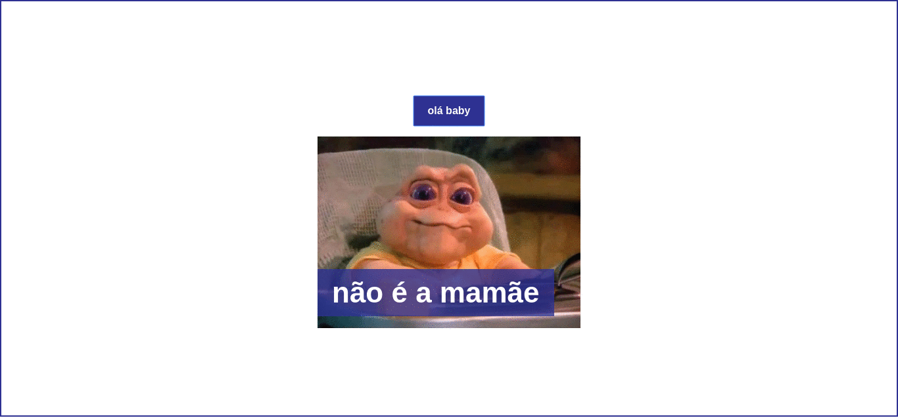

# Renderizando Condições

Vamos aprender a usar o poder das estruturas condicionais em nossos componentes. As estruturas condicionais estão presentes em nossa vida o tempo inteiro, é quando perguntamos 'se'. Por exemplo: 

Se chover então eu vou ficar em casa, senão eu vou para a rua.


```vue
<template>
  <div>
    <button>olá baby</button>
    <div>
    	
    	<p>é a mamãe</p>
    </div>
    <div>
    	
    	<p>não é a mamãe</p>
    </div>
  </div>
</template>

<script>
export default {
  name: 'Aula04',
  data () {
    return {
      mae: true
    }
  }
}
</script>
```

```vue
<template>
  <div>
    <button v-on:click="mae = !mae">olá baby</button>
    <div v-if="mae">
    	
    	<p>é a mamãe</p>
    </div>
    <div v-else> 
    	
    	<p>não é a mamãe</p>
    </div>
  </div>
</template>

<script>
export default {
  name: 'Aula04',
  data () {
    return {
      mae: true
    }
  }
}
</script>
```

