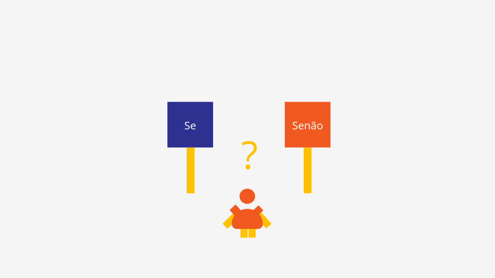

# Renderizando Condições

Vamos aprender a usar o poder das estruturas condicionais em nossos componentes. As estruturas condicionais estão presentes em nossa vida o tempo inteiro, é quando perguntamos 'se'. Por exemplo: 

Se chover então eu vou ficar em casa, senão eu vou para a rua.



Vamos analisar um exemplo prático!

```vue
<template>
	<section>
		<div>
			<h2>Time Amarelo</h2>
			<p>{{ timeAmarelo }}</p>
			<div>
				<button v-on:click="addtimeAmarelo()">+</button>
				<button v-on:click="removetimeAmarelo()">-</button>
			</div>
		</div>
		<div>
			<h2>Time Roxo</h2>
			<p>{{ TimeRoxo }}</p>
			<div>
				<button v-on:click="addTimeRoxo()">+</button>
				<button v-on:click="removeTimeRoxo()">-</button>
			</div>
		</div>
	</section>
</template>

<script>
	export default {
		name: 'Duelo',
		data() {
			return {
				timeAmarelo: 0,
				TimeRoxo: 0
			}
		},
		methods: {
			addtimeAmarelo() {
				return this.timeAmarelo++					
			},
			removetimeAmarelo() {
				return this.timeAmarelo--					
			},
			addTimeRoxo() {
				return this.TimeRoxo++
			},
			removeTimeRoxo() {
				return this.TimeRoxo--					
			}
		}
	}
</script>
```
Nada de novo até aqui, nesse exemplo, criamos o placar de um time usando métodos para adicionar ou remover pontos. Agora queremos melhorar esse placar! Queremos saber quem é o vencedor. Antes, vamos definir a lógica do que queremos fazer: Se o Time Roxo tiver mais pontos que o Time Amarelo então o Time Roxo é o vencedor, senão o Time Amarelo é o vencedor.

Em Javascript essa estrutura ficaria mais ou menos assim: 

```js
if() {

} else {

}
```
If significa se, e else significa senão. Se colocarmos uma expressão dentro dos parenteses do primeiro if e essa expressão for verdadeira então podemos retornar o que está dentro das chaves dele, senão retornamos o que está dentro das chaves do else.

```vue
<script>
	export default {
		name: 'Duelo',
		data() {
			return {
				timeAmarelo: 0,
				TimeRoxo: 0,
				vencedor: ''
			}
		},
		methods: {
			addtimeAmarelo() {
				return this.timeAmarelo++					
			},
			removetimeAmarelo() {
				return this.timeAmarelo--					
			},
			addTimeRoxo() {
				return this.TimeRoxo++
			},
			removeTimeRoxo() {
				return this.TimeRoxo--					
			},
			mostraVencedor() {
				if (this.TimeRoxo > this.timeAmarelo) {
					return this.vencedor = 'Time Roxo venceu'
				} else {
					return this.vencedor = 'Time Amarelo venceu'
				}
			}
		}
	}
</script>
```
